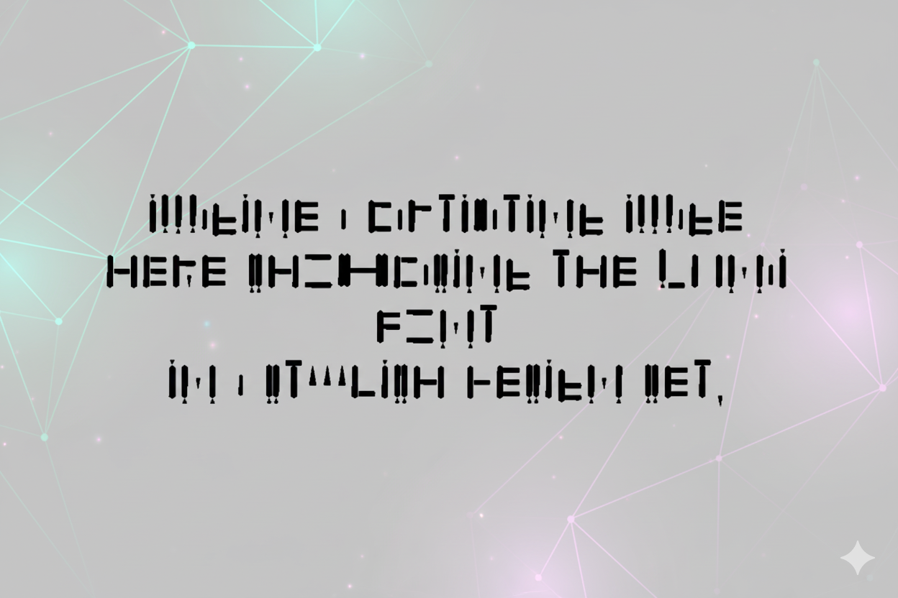

# 🖋️ Kunai Typeface

*A Modern Font Collection Inspired by Ancient Cuneiform*

***

Welcome to the **Kunai Fonts v0.1** collection, a typographic homage to the ancient art of cuneiform, one of the earliest known systems of writing. This font series is crafted to capture the essence and aesthetic of historical script while delivering a seamless and accessible experience for modern design.

---

### Font Preview




---

### Key Features

* **Historic Inspiration, Modern Appeal:** Blends the sharp, angular beauty of cuneiform with clean, contemporary design principles.
* **Versatile Formats:** Includes a comprehensive set of files for both desktop and web applications, ensuring broad compatibility.
* **Open Source:** Freely available under the GNU General Public License, empowering you to use, share, and modify it in your projects.

---

### Technical Specifications

* **Font Name**: Kunai Regular
* **Version**: 001.001
* **Release Date**: 30-12-2023
* **Created with**: Calligraphr.com

---

### Included Formats

To ensure maximum compatibility, this collection includes the following formats:

| Format      | Folder                  | Recommended Use    |
|-------------|-------------------------|--------------------|
| **`.otf`** | `/Local/`               | Desktop Publishing |
| **`.ttf`** | `/Local/`               | System-wide       |
| **`.woff`** | `/Kunai-Regular-Web-Fonts/` | Web Embedding      |
| **`.woff2`**| `/Kunai-Regular-Web-Fonts/` | Modern Web (Best Compression) |


---

### How to Use

#### **Desktop Installation**

1.  Navigate to the `Local` directory.
2.  Open either the `.otf` or `.ttf` file.
3.  Click the "Install" button. The font will now be available in your local applications (e.g., Adobe Suite, Microsoft Office).

#### **Web Implementation**

1.  Upload the contents of the `Kunai-Regular-Web-Fonts` folder to your web server.
2.  In your project's CSS file, define the font using the `@font-face` rule:

```css
@font-face {
  font-family: 'Kunai-Regular';
  src: url('path/to/your/fonts/Kunai-Regular.woff2') format('woff2'),
       url('path/to/your/fonts/Kunai-Regular.woff') format('woff');
  font-weight: normal;
  font-style: normal;
  font-display: swap;
}

body {
  font-family: 'Kunai-Regular', sans-serif;
}

License

This project is licensed under the GNU General Public License v3.0. You are free to share and adapt this font under the terms of this license.

For full details, please review the [LICENSE](LICENSE) file included in this repository.

We hope you enjoy bringing a touch of ancient history to your modern creations with the Kunai typeface!
